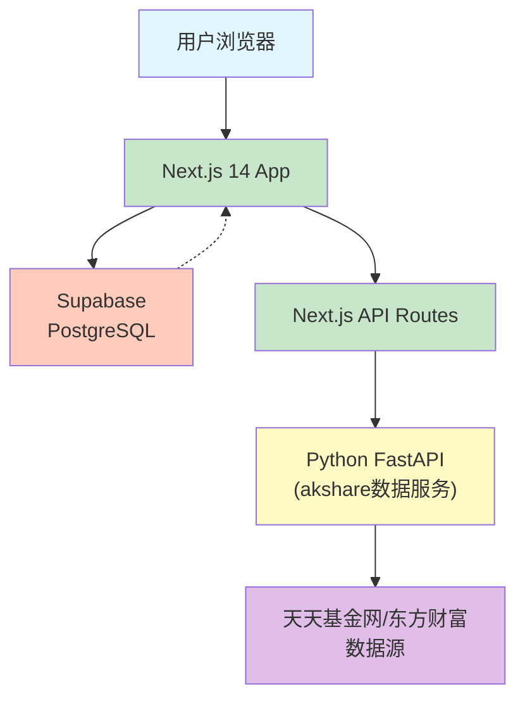

# 基金看板工具

<!-- 项目根级文档 -->

## 项目愿景

一个个人使用的基金投资看板工具，支持实时查看基金估值、自动计算持仓收益，并提供数据可视化管理。

---

## 变更记录 (Changelog)

| 时间 | 版本 | 变更内容 |
|------|------|----------|
| 2025-02-15 | v0.1.0 | 初始设计完成 - 架构设计、技术选型、数据模型定义 |

---

## 架构总览

### 技术栈
- **框架**: Next.js 14 (App Router)
- **语言**: TypeScript
- **样式**: Tailwind CSS
- **组件库**: shadcn/ui
- **图表**: Recharts
- **状态管理**: TanStack Query + Zustand
- **后端**: Next.js API Routes + Python FastAPI (akshare数据获取)
- **数据库**: Supabase (PostgreSQL + 身份认证)
- **部署**: Vercel

### 系统架构图



---

## 模块索引

| 模块路径 | 职责 | 状态 |
|----------|------|------|
| [app/](./app/CLAUDE.md) | Next.js App Router 应用目录 | 待创建 |
| [components/](./components/CLAUDE.md) | React 组件库 | 待创建 |
| [lib/](./lib/CLAUDE.md) | 工具函数与共享库 | 待创建 |
| [api/](./api/CLAUDE.md) | API路由与后端逻辑 | 待创建 |
| [python-service/](./python-service/CLAUDE.md) | Python数据服务(akshare) | 待创建 |

---

## 数据架构

### 用户持仓表 (holdings)

```typescript
interface Holding {
  id: string;
  user_id: string;
  fund_code: string;    // 基金代码
  fund_name: string;    // 基金名称
  shares: number;       // 持有份额
  cost_price: number;   // 成本单价
  created_at: Date;
  updated_at: Date;
}
```

### 基金净值表 (fund_nav)

```typescript
interface FundNav {
  fund_code: string;
  nav: number;          // 当日净值
  nav_date: Date;       // 净值日期
  daily_change: number; // 日涨跌幅%
  accum_nav: number;    // 累计净值
  created_at: Date;
}
```

---

## 运行与开发

### 环境变量配置

```bash
# Supabase
NEXT_PUBLIC_SUPABASE_URL=your-project-url
NEXT_PUBLIC_SUPABASE_ANON_KEY=your-anon-key
SUPABASE_SERVICE_ROLE_KEY=your-service-role-key

# Python服务(可选)
PYTHON_API_URL=your-python-service-url
```

### 首次部署步骤

1. 创建Supabase项目
2. 初始化数据库表结构
3. 部署到Vercel
4. 配置环境变量

---

## 测试策略

### 计划中的测试覆盖

| 类型 | 工具 | 覆盖范围 |
|------|------|----------|
| 单元测试 | Vitest/Jest | 工具函数、Hook |
| 组件测试 | Testing Library | UI组件 |
| E2E测试 | Playwright | 核心用户流程 |
| API测试 | Vitest + MSW | API路由 |

---

## 编码规范

- 使用 TypeScript 严格模式
- 组件使用函数式组件 + Hooks
- 状态管理优先使用 Zustand
- API调用使用 TanStack Query
- UI组件优先使用 shadcn/ui
- Tailwind CSS 类名顺序遵循官方规范

---

## AI使用指引

### 生成代码时应注意

1. **基金数据准确性**: 涉及金额计算必须使用精确数字运算，避免浮点误差
2. **响应式设计**: 看板需要在移动端和桌面端都正常显示
3. **数据刷新策略**: 支持手动刷新，避免自动轮询造成不必要的API调用
4. **错误处理**: 基金数据获取失败时要有降级显示

### 常用开发模式

- 新页面: `app/(route)/page.tsx`
- 新组件: `components/ui/*` (shadcn) 或 `components/custom/*` (业务)
- API端点: `app/api/*/route.ts`
- 工具函数: `lib/utils.ts` 或 `lib/*`
- 类型定义: `types/*.ts`

---

## 后续扩展方向

- [ ] 定投计划跟踪
- [ ] 收益对比基准(沪深300等)
- [ ] 基金筛选器
- [ ] 收益归因分析

---

**设计确认日期**: 2025-02-15
